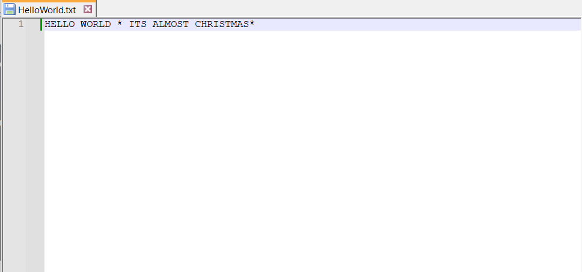
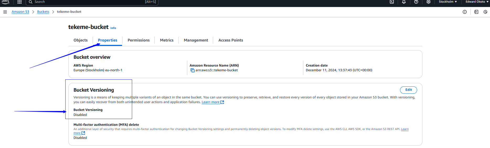
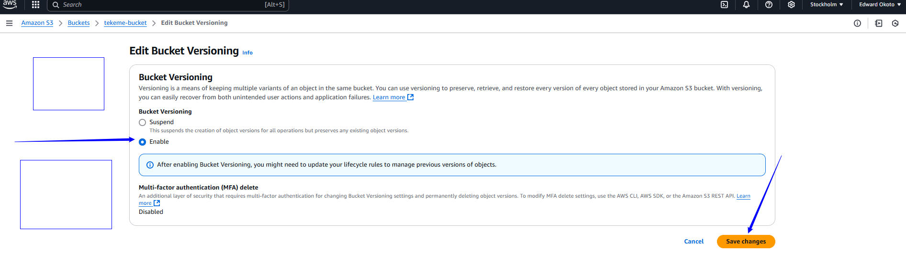
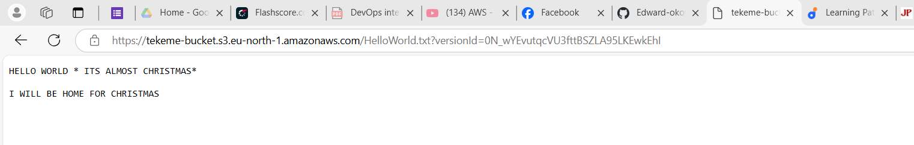

# AWS S3
 Project Goals
 The primary goal of this project is to familiarize learners with the Amazon S3 (simple storage service) and the fundamentals concepts.Participants will learn how to create and manage S3 buckets,uploads objects, enable versioning, set permissions for public access, and implement lifecycle policies.

 ### Learning Outcomes

 By the end of this project,participants would have gained practical experience in working with Amazon S3 and will be able to:
 * Create and configure S3 buckets using the AWS management console.
 * Upload files and manage objects within S3 buckets.
 * Understand the importance of versioning and its implication in data management.
 * Configure permissions to control access to S3 objects.
 * Implement lifecycle poilices to automate data management tasks and optimize storage costs.

 ### What is Amazon S3?
 Amazon S3 bucket is a storage container in Amazon Simple Storage Service (Amazon S3). It's used to store objects, which can be any kind of data such as files, images, videos, backups, and more. Here are some key points about S3 buckets:
* Storage Container: Think of a bucket as a folder where you can store your data.
* Objects: Each object within a bucket is a file along with its metadata.
* Unique Names: Each bucket name must be globally unique across all AWS accounts.
* Regions: Buckets are created in specific AWS regions, and data stored in a bucket is stored in that region.
* Access Control: You can configure access policies to control who can access the objects in your bucket.

### S3 Benefits.

Amazon S3 (Simple Storage Service) offers a wide range of benefits that make it a popular choice for cloud storage. 
* Scalability: S3 can easily scale up or down to meet your storage needs without any disruption or manual intervention.
* Durability and Availability: S3 is designed for 99.999999999% (11 nines) durability and offers high availability, ensuring your data is safe and accessible.
* Cost-Effective: You only pay for the storage you use, and there are various storage classes (like S3 Standard, S3 Intelligent-Tiering, and S3 Glacier) to optimize costs based on data access patterns.
* Security: S3 provides robust security features, including encryption, access control policies, and integration with AWS Identity and Access Management (IAM) to manage permissions.
* Data Management: With features like versioning, lifecycle policies, and replication, you can efficiently manage your data throughout its lifecycle.
* Global Infrastructure: S3 buckets are available across multiple AWS regions, allowing you to store data closer to your users and comply with data residency requirements.
* Integration: S3 integrates seamlessly with a wide range of AWS services (such as EC2, Lambda, and CloudFront) and third-party tools, enabling versatile use cases.
* Performance: S3 offers low latency and high throughput, suitable for various applications, from backup and recovery to big data analytics and content distribution.

These benefits make Amazon S3 a highly flexible, reliable, and secure option for storing and managing data in the cloud.

### S3 Use Cases.

Amazon S3 is incredibly versatile, supporting a wide range of use cases across different industries. Here are some common use cases for S3:
* Backup and Restore: Companies use S3 to back up critical data due to its durability and scalability. It can store backups for applications, databases, and virtual machines.
* Data Archiving: S3's storage classes like Glacier and Glacier Deep Archive are ideal for long-term data archiving, offering cost-effective storage for infrequently accessed data.
* Big Data Analytics: S3 can store vast amounts of data for analytics. It integrates well with AWS analytics tools like Athena, EMR, and Redshift, enabling big data processing and analysis.
* Content Storage and Distribution: S3 is used to store and distribute static content like images, videos, and documents for websites and applications. It integrates seamlessly with Amazon CloudFront for content delivery.
* Disaster Recovery: S3 can be part of a disaster recovery plan, providing offsite storage for data replicas to ensure data availability and integrity in case of site failures.
* Application Hosting: Static websites can be hosted directly on S3, leveraging its high availability and scalability to serve web content.
* Data Lake: S3 serves as a central repository for data lakes, allowing organizations to store structured and unstructured data at any scale and analyze it with various AWS services.
* Log Storage and Analysis: S3 can store logs generated by applications and services. These logs can then be analyzed using AWS services like AWS Lambda, AWS Glue, and Amazon Athena.
* Media Hosting: Media companies use S3 to store and distribute media files like videos and music, leveraging its reliability and scalability to handle large volumes of data.
* Machine Learning: S3 is used to store training data for machine learning models. It integrates with AWS machine learning services like SageMaker for model training and deployment.

### S3 Core Concepts
Amazon S3 (Simple Storage Service) revolves around several core concepts that are fundamental to understanding how it works:
* Buckets: A bucket is a container for storing objects. All objects are stored in buckets, and each bucket has a unique name globally. You can configure access control settings and geographic region settings for each bucket.
* Objects: The data you store in S3 is called an object. Each object consists of data, metadata, and a unique identifier (key). An object is stored in a bucket and can be up to 5 terabytes in size.
* Keys: A key is the unique identifier for an object within a bucket. Keys are used to retrieve objects and can include prefix paths, making it easy to organize objects into a hierarchy similar to a file system.
* Regions: S3 buckets are created in specific AWS regions, and data stored in a bucket is stored in that region. Choosing the right region for your bucket can improve latency and ensure compliance with local data residency regulations.
* Access Control: S3 provides several mechanisms to control access to your data, including bucket policies, IAM policies, Access Control Lists (ACLs), and presigned URLs. These controls help you manage who can access your data and what they can do with it.
* Storage Classes: S3 offers different storage classes to optimize cost and performance based on data access patterns. These include:

      *S3 Standard: General-purpose storage for frequently accessed data*.

      *S3 Intelligent-Tiering: Automatically moves data between two access tiers when access patterns change*.

      *S3 Standard-IA (Infrequent Access): For data accessed less frequently but requires rapid access when needed*.

      *S3 One Zone-IA: For infrequently accessed data stored in a single availability zone*.

      *S3 Glacier: Low-cost storage for data archiving with retrieval times ranging from minutes to hours*.

      *S3 Glacier Deep Archive: The lowest-cost storage option for long-term data archiving with retrieval times in hours*.

* Versioning: S3 supports versioning to keep multiple versions of an object in the same bucket. This helps protect against accidental overwrites and deletions.

* Lifecycle Policies: These policies allow you to automatically transition objects to different storage classes or delete them after a specified period, helping you manage storage costs and data retention.

* Replication: S3 provides Cross-Region Replication (CRR) and Same-Region Replication (SRR) to replicate objects across different buckets or regions, improving data durability and availability.

* Data Consistency: S3 provides strong read-after-write consistency for PUTS and DELETES of objects, ensuring that all subsequent read requests immediately reflect the latest write.

### S3 Versioning

Amazon S3 versioning is a feature that allows you to keep multiple versions of an object in the same bucket. This helps you protect data from being accidentally deleted or overwritten. Here are some key aspects of S3 versioning:

* Multiple Versions: When versioning is enabled on a bucket, S3 keeps multiple versions of an object. Each version of an object is assigned a unique version ID.
* Data Protection: Versioning allows you to recover from accidental deletions or overwrites. If you delete an object, S3 adds a delete marker rather than removing the object entirely, and you can restore the previous version.
* Object Recovery: You can retrieve and restore previous versions of an object, which is useful for recovering from unintended changes.
* Lifecycle Management: You can use lifecycle policies to manage the versions of objects, such as transitioning older versions to a lower-cost storage class or automatically deleting them after a specified period.
* Compliance: Versioning helps you meet compliance requirements by ensuring that historical versions of data are retained.

Example of S3 Versioning in Action:

Imagine you have a document stored in an S3 bucket. With versioning enabled, each time you upload a new version of the document, S3 assigns a unique version ID to it. If you accidentally delete the document or need to revert to a previous version, you can easily do so by restoring the desired version.

Benefits of S3 Versioning

* Accidental Deletion Protection: Recover accidentally deleted objects.
* Overwrite Protection: Restore objects that were unintentionally overwritten.
* Data Archiving: Maintain historical versions of your data for audit and compliance purposes.

# PRACTICALS

## Creation of AWS S3 Bucket
* Login to your AWS account and navigate to the search bar and type "S3" and click s3 

  

* You would be directed to the S3 page, click "Create bucket"

  
* a) Choose your bucket name

  b) Select "ACL Disabled" for object ownership.

  c) Ensure to check "Block all public access" option.

  d) Proceed with the default settings

  e) Click on "Create bucket" to finalize creation process

  

  
  
  
  

  Bucket successfully created
  
  

## Uploading Object into the Bucket (tekeme-bucket)
 * Create a file on your computer and save the file.

   

 * Click on the "Upload" button

   

 * Click "Add file"

   

 * Add file and click "Upload" to complete the process.

   

   File was successfully uploaded.

   

## Enabling Versioning

 * In the bucket "Properties" section, notice that "Bucket versioning" is currently disabled.

   

* Let change it, click on "Edit"

   

* Select "Enable" and click "Save changes

   

* If you modify the content of your file and upload it again,you would create a new version of the file.

  

* By clicking on "Show versions" you will be able to see the versions of the file uploaded.

  

## View the Content of the Versions and Set-Permissions 

* In the "Permission" section, you would notice "Block all public access " is enabled, click on edit and make changes.
  
   

* Uncheck "Block all public access " and save changes.
 
   

* Type "confirm" and click on "Confirm": By taking this action, you are allowing public accessibility, and this confirmation steps ensures you are aware of the implications.

   
    

* Next, you will need to create a "Bucket Policy" to specify the actions you would want the public to perform on your file. 
on the "Bucket policy" section, click on Edit

  

* Next, click on "Policy generator"
   
   

* Select the "Type of Policy" as "S3 bucket policy"

  a) set the "Effect" to "Allow"

  b) Specify the "Principal" to "/*" which means all users.

  c) Choose the object "Get object" and "Get Object Version"

  d) In the field of amazon Resource Name (ARN), type the arn of your bucket and add " /* " to it.You can get the arn for here 

     

  e) Click on " Add statement"
 
    

* Next click "Generate Policy"  
  Copy the policy code  and click on close
   
   

* Paste the policy in this space and click save changes
  
  
  

* On "Object" section, click on this version of your file
  

* Click on the object URL.Here you will see the previous data.
  

* Do same for the latest version to see the data of the latest version.Click on the latest version.
 
  

* Click the URL and you will get the latest data.
  
  

## Creating Lifecycle

* Navigate to the management section of the bucket.

   

* Click on "Create lifecycle"
   
   

* Name the lifecyle rule and choose other desired specifications and click "Create rule"

   
   

* Rule has been created.

  

  This rule is set up to automatically move files from one type of storage to another in your Amazon S3 bucket. Specifically, it moves file to a storage type called Standard-IA after they have been sitting in your bucket for 30days. This helps save cost because Standard-IA is cheaper than the default storage option.Therefor if you have files that you dont access very often,but still want to keep, this rule helps you save cost by storing them in a cheaper storage class after a certain period of time.

  # Project Conclusions.

  ###### *Learners have gained hands-on experience with Amazon S3,a core service for Amazon*.
  ###### *Learners have managed S3 bucket and objects,they have learnt key concept like versioning,permissions management and lifecycle policies*.
  ###### *Through practical tasks, learners have developed a solid understanding of Amazon S3 features*.
  ###### *Learned to optimize storage cost  and ensure data reliability and accessibility using AWS S3 features*
  ###### *Learners have been equipped with valuable skills applicable to real-life scenarios*.

